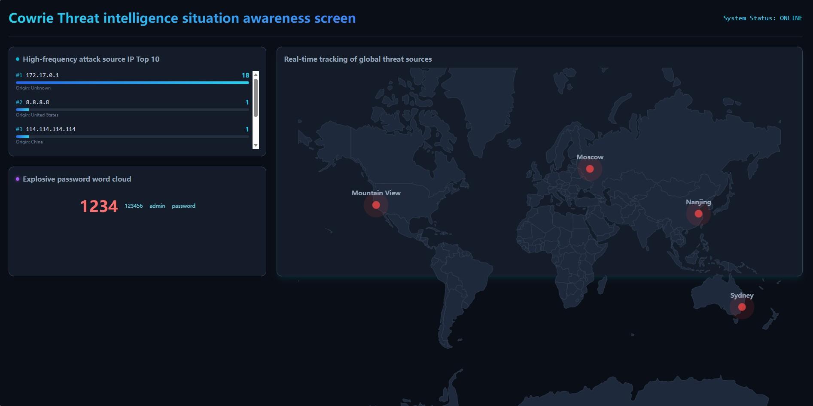

# EdgeGuard: Threat Intelligence Situation Awareness Platform


A full-stack, real-time threat intelligence dashboard designed to visualize SSH/Telnet brute-force attacks captured by a Cowrie honeypot. 

## Key Features
* **Real-Time Global Tracking:** Maps attacker IP addresses to geographic coordinates using the MaxMind GeoLite2 engine.
* **Threat Analytics:** Identifies high-frequency attack source IPs dynamically.
* **Credential Intelligence:** Visualizes explosive password attempts (weak credentials) via a dynamic word cloud.
* **Automated Data Pipeline:** A robust Python daemon that parses honeypot logs, enriches them with GeoIP data, and stores them in MySQL.

## Architecture
1. **Sensor:** Cowrie Honeypot intercepts unauthorized access attempts.
2. **ETL Engine:** Python script extracts telemetry, resolves IP geolocation, and persists data to a MySQL relational database.
3. **Backend API:** Lightweight Flask REST API serves threat intelligence to the frontend.
4. **Frontend Dashboard:** React.js + Vite application utilizing `react-simple-maps` for interactive threat visualization.

## Dashboard Preview


## How to start
### 1. Database Setup
Execute the SQL schema to initialize the `attacks` table:
```sql
CREATE DATABASE edgeguard;
USE edgeguard;

CREATE TABLE attacks (
    id INT AUTO_INCREMENT PRIMARY KEY,
    src_ip VARCHAR(50) NOT NULL,
    username VARCHAR(100),
    password VARCHAR(255),
    country VARCHAR(100),
    city VARCHAR(100),
    latitude DECIMAL(10, 6),
    longitude DECIMAL(11, 6),
    timestamp DATETIME DEFAULT CURRENT_TIMESTAMP
);
```

### 2. Backend Environment (Flask API)
Navigate to the backend directory, set up the Python virtual environment, install dependencies, and start the server:
```bash
cd backend
python3 -m venv venv
source venv/bin/activate
pip install -r requirements.txt
python3 app.py
```

### 3. frontend Environment (React Dashboard)
```bash
cd frontend
npm install --legacy-peer-deps
npm run dev
```
